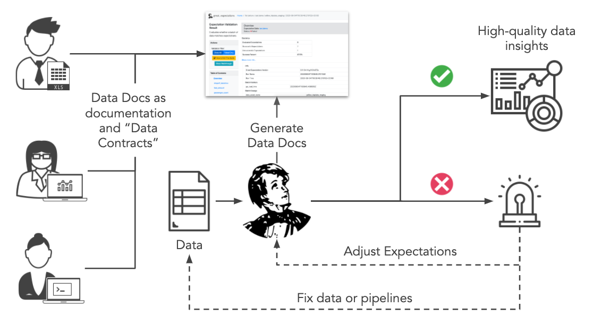

# Great Expectations 201: Customizing Great Expectations for Collaboration

**Sam Bail, Superconductive**
**August 2020**

---

## Welcome!

- **Quick intro - who are we?** (5 minutes)
- **Customizing Great Expectations for Collaboration** (40 minutes)
    - Intro: What do we mean by collaboration?
    - Example: Our running example for today
    - Customization options
        1. Customizing Datasources
        2. Customizing stores for Validation results
        3. Customizing Data Docs hosting
        4. Customizing notifications
- **Q&A session** (15 minutes)

---

## Communication modes

- This will mostly be a presentation style webinar
- Feel free to post questions in the Zoom chat
    - We'll stop after each section to answer them
- We might answer some more in-depth questions via Slack after the webinar!
- We're recording the webinar and content will be made available after
- Our community Code of Conduct also applies to our webinars
- **Please fill in the survey (posted in the Zoom chat) after the session**!

---

## Who are we?

- We're **Superconductive**, the company behind Great Expectations
- Today's team:
    - Sam Bail (@spbail): Technical Lead of the Partnerships team at Superconductive
    - Eugene Mandel (@eugmandel): Head of Product at Superconductive
    - Kyle Eaton (@supercokyle): DevRels, marketing, design, community, all the things!

---

## Intro: What do we mean by "collaboration"?

This is usually how Great Expectations gets adopted by a data team...

---

## Example: Quick background on our demo setup

Let's assume our analytics pipeline looks something like this

---

## Example: Validation result for the staging data

---

## Example: What's in our local Great Expectations deploy?

- A Datasource `my_postgres_db` connected to a local Postgres database containing two tables
    - January taxi ride data
    - February taxi ride data in a "staging" table
- An Expectation Suite `taxi.demo` with a few simple expectations
- A Checkpoint `taxi.demo.staging.chk` that validates the staging table against the Expectation Suite

---

## Customization overview

1. Datasources
2. Stores for Validation results
3. Data Docs hosting
4. Notifications

---

## 1. Datasources

- This is not directly related to collaboration, but let's start with configuring a new Datasource
- You can list your Datasources with `great_expectations datasource list`
- ... and add a new one with `great_expectations datasource new`
- Alternatively, you can manually add it to your `great_expectations.yml`
- I will demo this quickly! 

---

## 2. Stores for Validation results

- By default, GE stores Validation results in a JSON file in your local directory
- We call the location where GE stores them... a *Store* ;)
- See the `stores` section in `great_expectations.yml` 
- We strongly recommend moving to a shared Validation store as soon as you can!
- I will demo configuring an S3 store

---

## 3. Data Docs hosting

- Data Docs are basically a rendered version of your Expectations and Validation results
- They are your way of communicating what you *expect* from your data and what you *observe* in each batch
- They should be accessible by everyone on the team!
- I'll demo how to configure Data Docs HTML output to be stored in S3
- Access control is up to you and the respective platform

---

## 4. Configuring notifications

- GE comes with built-in *Validation Operators* which allow you to trigger *Validation Actions* after a Validation run
- They're also configured in `great_expectations.yml`
- We have a built-in Slack notification action
- You can also implement your own notification action by subclassing `ValidationAction`
- I'm going to demo the Slack notification real quick

---

## Team workflows with Great Expectations

---

## Recap and wrap-up
- We've showed you
    - How to configure a new Datasource
    - How to customize your Validation stores
    - How to set up remote Data Docs hosting
    - How to configure notifications
- Next up: Q&A - **please post your questions in the chat!**

---

## What's next? (Aka future webinar topics)
 
- **In-memory Data Contexts**
    - What do you do in a hosted environment?
    - We're working on simplifying the setup this quarter!
- **Built-in profiling**: Automatically create expectations based on the data
    - Try out the `suite scaffold` command
    - We're working a lot on profiling this quarter, e.g. to enable profiling across multiple batches of data
    
    
---

## And finally...

- Great Expectations is an **open source project** - join our community!
    - Check out the docs: link on **greatexpectations.io**
    - Join our Slack channel: link on **greatexpectations.io**
    - Star us on GitHub: link on **greatexpectations.io**
- **We're looking for new users to test our "Getting started" tutorial** 
    - DM me please!
- **Please fill in the survey (posted in the Zoom chat) after the session!**
- **We offer partnerships & consulting services: superconductive.com** 

